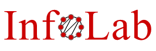

<p align="center">
    
</p>
<p align="center">
    
</p>

# A model to identify Manipulative Language
**[Diletta Goglia](https://orcid.org/0000-0002-2622-7495), 
[Davide Vega](https://orcid.org/0000-0001-8795-1957),
[Ece Calikus](https://gandelli.dev/),**</br>[diletta.goglia@it.uu.se](mailto:diletta.goglia@it.uu.se) (D.G.), [davide.vega@it.uu.se](mailto:davide.vega@it.uu.se) (D.V.), [ece.calikus@it.uu.se](mailto:ece.calikus@it.uu.se) (E.C.)


_[UU-InfoLab](https://uuinfolab.github.io/), Department of Information Technology, Uppsala University, Uppsala, Sweden_


[](ic2s2/poster_goglia.pdf)


## Resources 
Our model will be released soon! 
[Stay in touch](mailto:diletta.goglia@it.uu.se?subject=IC2S2%20Poster&body=Hi%2C%0A%0AI%20saw%20your%20poster%20at%20IC2S2.%0ALet%27s%20keep%20in%20touch%20for%20updates%21) for updates.


## Contact 
This repository is actively maintained. For any questions or further information, please feel free to contact the **corresponding author:**

Diletta Goglia <a href="https://orcid.org/0000-0002-2622-7495"></a> <br/>
Ph.D. Candidate at Uppsala University Information Laboratory [(UU-InfoLab)](https://uuinfolab.github.io/) research group. <br/>
Information Technology Department, Uppsala University, Sweden. <br/>
[diletta.goglia@it.uu.se](mailto:dilettagoglia@it.uu.se) <br/>
[@dilettagoglia.bsky.social‬](@dilettagoglia.bsky.social‬)
<!-- [dilettagoglia.netlify.app](http://www.dilettagoglia.netlify.app) <br/> -->


---
_Last update: July 2025_

## Directory structure
```
.
├── data/
│   ├── training_set.py
│   ├── test_set.py                               
│   └── youtube/                    #   'Supernanny' TV show episodes
│       ├── data_raw/               #   audio files of each episode (subdirs correspond to seasons)
│       ├── data_clean/             #   diarization (transcripts + VAD)
│       └── data_analysis/          #
├── models/                         #
├── img/
├── annotations/
│   ├── to_annotate/                # csv files, automatically generated
│   ├── llama3/                     # one csv per experiment 
│   ├── gpt4/                       # 
│   └── human-annotated/            # one csv file per annotator
├── src/
│   ├── __init__.py                 
│   ├── utilities.py
│   ├── youtube.py
│   ├── diarization.py
│   ├── generate_annot_files.py                    
│   ├── annot_agreement.py
│   ├── human_mach_comparison.py
│   ├── pseudolabeling.py
│   └── test.py             
├── requirements.txt
└── README.md
```
